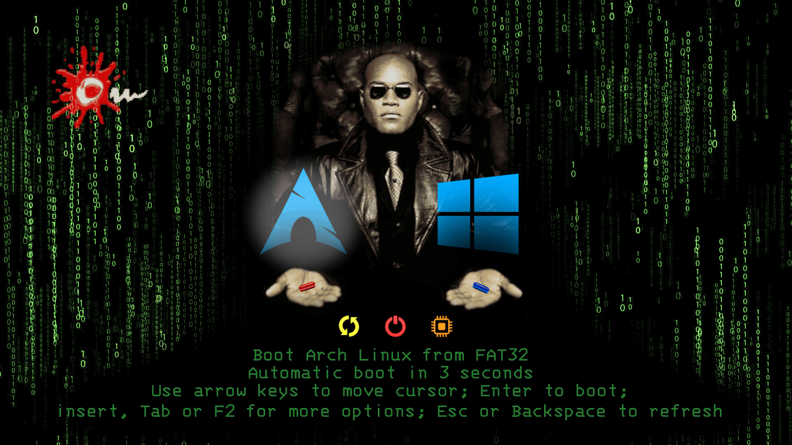

# rEFInd-theMe-MatriX
A rEFInd theme based on the scene from the movie Matrix where Morpheus offers the two pills to Neo.

A clean theme for the [rEFInd UEFI Boot Manager](http://www.rodsbooks.com/refind/)
based on the default colorscheme.

On the default theme we roll our icons, fonts and more.

## Installation

1. Find the rEFInd directory on your boot volume. For me, it's `/boot/EFI/refind`.
   (Note: you will likely need to do this as root)

2. Copy theme files to the same directories inside the rEFInd directory. Overwrite when copying, if needed.

## Additional Information

Additional information about configuring rEFInd may be found [here](http://www.rodsbooks.com/refind/configfile.html).
